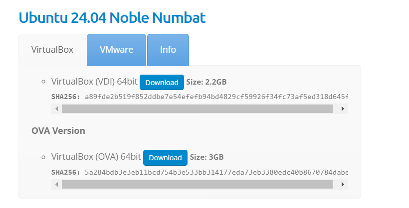
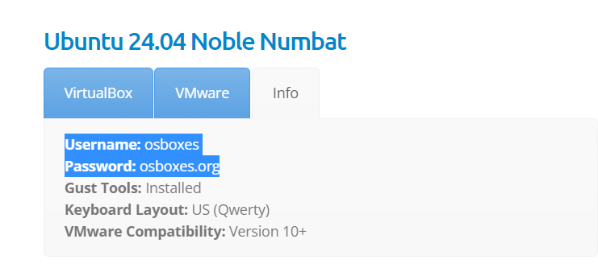

https://www.oracle.com/co/virtualization/technologies/vm/downloads/virtualbox-downloads.html  --> oracle virtualbox installation

https://www.osboxes.org/ubuntu/ --> os images






Target 0: Set up Ubuntu Server with Apache, MySQL, PHP, Python & Nodejs on Oracle VirtualBox with 8 GB virtual disk.
Install Oracle VirtualBox:

Download and install Oracle VirtualBox from here.
Create a new virtual machine:

Open VirtualBox and click on "New".
Name your VM (e.g., "UbuntuServer").
Set the type to "Linux" and version to "Ubuntu (64-bit)".
Allocate memory (e.g., 2048 MB).
Create a virtual hard disk now, choose VDI (VirtualBox Disk Image), dynamically allocated, and set the size to 8 GB.
Install Ubuntu Server:

Download the Ubuntu Server ISO from here.
Start the VM and select the downloaded ISO as the startup disk.
Follow the installation steps to install Ubuntu Server.
Install Apache, MySQL, PHP, Python & Nodejs:

Once the server is installed, log in and update the package list:

`sudo apt update`

Install Apache: `sudo apt install apache2`
Install MySQL: `sudo apt install mysql-server`
Install PHP: `sudo apt install php libapache2-mod-php php-mysql`
Install Python: `sudo apt install python3`
Install Node.js: `sudo apt install nodejs npm`
Target 1: Set up virtual hosts on Apache.
Create a directory for your site:
```
sudo mkdir -p /var/www/local.example.com/public_html
sudo chown -R $USER:$USER /var/www/local.example.com/public_html
sudo chmod -R 755 /var/www
```

Create a sample index.html file: `echo "<html><body><h1>local.example.com</h1></body></html>" > /var/www/local.example.com/public_html/index.html`

Create a virtual host configuration file:
`sudo nano /etc/apache2/sites-available/local.example.com.conf`

Add the following content:
```
<VirtualHost *:80>
    ServerAdmin webmaster@localhost
    ServerName local.example.com
    DocumentRoot /var/www/local.example.com/public_html
    ErrorLog ${APACHE_LOG_DIR}/error.log
    CustomLog ${APACHE_LOG_DIR}/access.log combined
</VirtualHost>
```

Enable the new virtual host:
```
sudo a2ensite local.example.com.conf
sudo systemctl restart apache2
```
Target 2: Set up Wordpress on virtual machine under virtual host set up in Target 1.
Download and extract Wordpress:
```
cd /tmp
wget https://wordpress.org/latest.tar.gz
tar -xvzf latest.tar.gz
sudo mv wordpress /var/www/local.example.com/public_html
```

Set the correct permissions:
```
sudo chown -R www-data:www-data /var/www/local.example.com/public_html
sudo chmod -R 755 /var/www/local.example.com/public_html
```

Create a MySQL database and user for Wordpress:
`sudo mysql -u root -p`
Inside the MySQL shell:
```
CREATE DATABASE wordpress;
CREATE USER 'wordpressuser'@'localhost' IDENTIFIED BY 'password';
GRANT ALL PRIVILEGES ON wordpress.* TO 'wordpressuser'@'localhost';
FLUSH PRIVILEGES;
EXIT;
```

Complete the Wordpress installation:

Open a web browser and navigate to `http://local.example.com.`
Follow the on-screen instructions to complete the installation.
Target 3: Set up /etc/hosts file on the VM to resolve local.example.com locally to the Wordpress installation that you have set up in Target 2.
Edit the /etc/hosts file:
`sudo nano /etc/hosts`
Add the following line:
`127.0.0.1 local.example.com`
Target 4: Write automation using wp-cli to set up second domain local.test.com to resolve to another wordpress installation.
Install wp-cli:
```
curl -O https://raw.githubusercontent.com/wp-cli/builds/gh-pages/phar/wp-cli.phar
chmod +x wp-cli.phar
sudo mv wp-cli.phar /usr/local/bin/wp
```

Create a script to automate the setup:
```
sudo mkdir -p /var/www/local.test.com/public_html
sudo chown -R $USER:$USER /var/www/local.test.com/public_html
sudo chmod -R 755 /var/www

sudo cp -r /var/www/local.example.com/public_html/* /var/www/local.test.com/public_html/

sudo nano /etc/apache2/sites-available/local.test.com.conf
```
Add the following content:
```
<VirtualHost *:80>
    ServerAdmin webmaster@localhost
    ServerName local.test.com
    DocumentRoot /var/www/local.test.com/public_html
    ErrorLog ${APACHE_LOG_DIR}/error.log
    CustomLog ${APACHE_LOG_DIR}/access.log combined
</VirtualHost>
```

Enable the new virtual host:
```
sudo a2ensite local.test.com.conf
sudo systemctl restart apache2
```

Edit the /etc/hosts file:
`sudo nano /etc/hosts`
Add the following line:
`127.0.0.1 local.test.com`
Automate Wordpress setup using wp-cli:
```
cd /var/www/local.test.com/public_html
wp core config --dbname=wordpress_test --dbuser=wordpressuser --dbpass=password --dbhost=localhost --dbprefix=wp_
wp db create
wp core install --url="http://local.test.com" --title="Local Test" --admin_user="admin" --admin_password="password" --admin_email="admin@example.com"
```

Target 5: Set up a simple web page with single field HTML form on VM to accept a <domain> as input and run the automation written in Target 4 to set up complete Wordpress installation at local.domain.com.
Create a simple HTML form:
`sudo nano /var/www/html/index.html`
Add the following content:
```
<html>
<body>
    <form action="setup.php" method="post">
        Domain: <input type="text" name="domain">
        <input type="submit">
    </form>
</body>
</html>

```
Create the setup.php script:
`sudo nano /var/www/html/setup.php`
Add the following content:
```
<?php
$domain = $_POST['domain'];
$dir = "/var/www/$domain/public_html";

// Create directory
mkdir($dir, 0755, true);

// Copy Wordpress files
shell_exec("cp -r /var/www/local.example.com/public_html/* $dir");

// Create virtual host
$vhost = "<VirtualHost *:80>
    ServerAdmin webmaster@localhost
    ServerName $domain
    DocumentRoot $dir
    ErrorLog \${APACHE_LOG_DIR}/error.log
    CustomLog \${APACHE_LOG_DIR}/access.log combined
</VirtualHost>";
file_put_contents("/etc/apache2/sites-available/$domain.conf", $vhost);

// Enable site and restart Apache
shell_exec("sudo a2ensite $domain.conf");
shell_exec("sudo systemctl restart apache2");

// Add to /etc/hosts
file_put_contents("/etc/hosts", "127.0.0.1 $domain\n", FILE_APPEND);

// Run wp-cli commands
shell_exec("wp core config --dbname=wordpress_$domain --dbuser=wordpressuser --dbpass=password --dbhost=localhost --dbprefix=wp_ --path=$dir");
shell_exec("wp db create --path=$dir");
shell_exec("wp core install --url=\"http://$domain\" --title=\"$domain\" --admin_user=\"admin\" --admin_password=\"password\" --admin_email=\"admin@example.com\" --path=$dir");

echo "Wordpress installation for $domain completed.";
?>
```

