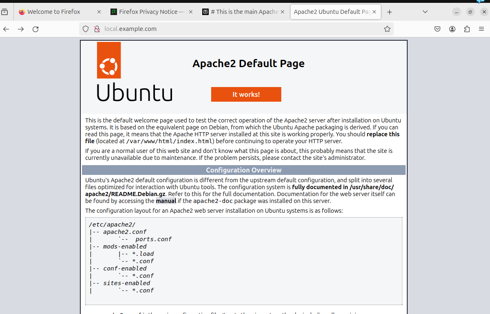

# devops-task-assignment

Objective: Build automation to deploy web apps at scale:
Target 0: Set up Ubuntu Server with Apache, MySQL, PHP, Python & Nodejs on
Oracle VirtualBox with 8 GB virtual disk.
Target 1: Set up virtual hosts on Apache.
Target 2: Set up Wordpress on virtual machine under virtual host set up in Target 1. Target 3: Set up /etc/hosts file on the VM to resolve local.example.com locally to the Wordpress installation that you have set up in Target 2.
Target 4: Write automation using wp-cli to set up second domain local.test.com to resolve to another wordpress installation.
Target 5: Set up a simple web page with single field HTML form on VM to accept a <domain> as input and run the automation written in Target 4 to set up complete Wordpress installation at local.domain.com.
I
Submission 1 (Before technical discussion): Record your screen explaining the whole implementation. Upload the recording on YouTube as an unlisted Video and share it's link as the submission..
Submission 2 (After technical discussion): Export the whole virtual machine as appliance and ask for permission to upload here.
Note: Please make necessary assumptions to complete the assignment.*

