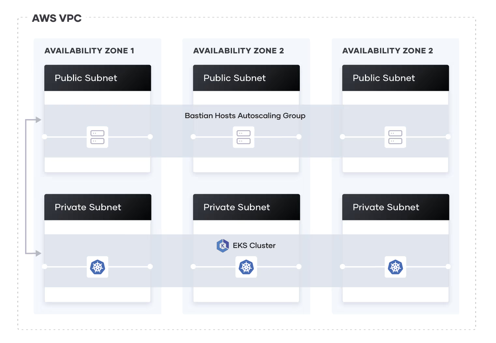

The basic idea here is to automate everything 

## Entire Workflow

>> Developers commit code changes to the main branch.  
The GitHub Action triggers the CI/CD pipeline, which:  
Checks out the code and sets up AWS credentials.  
Builds the Docker image, tags it, and pushes it to ECR.  
Uses Helm to install or upgrade the application and Prometheus/Grafna in   an automated fashion, ensuring monitoring and logging components are set up without manual intervention.

# 1. infrastructure setup
1. Eks cluster creation 
2. configure IAM roles, security groups, access policies for kubernetes
3. 

## EKS creation using Terraform 
1. create one IAM user and get accesskey and secret key for it

2. Do aws configure and attach acceskey and secret key and also keep both of this values in github repository secret variables

